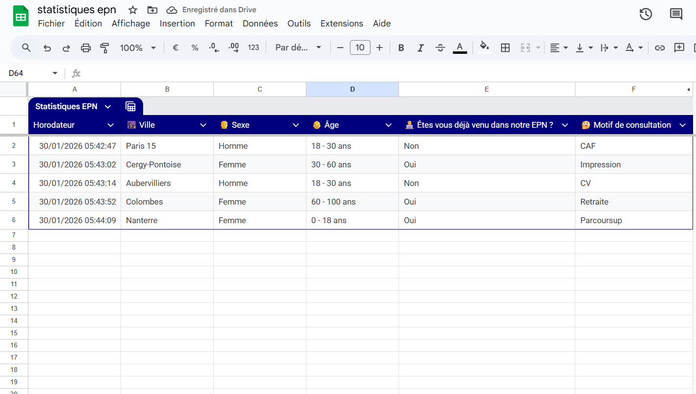
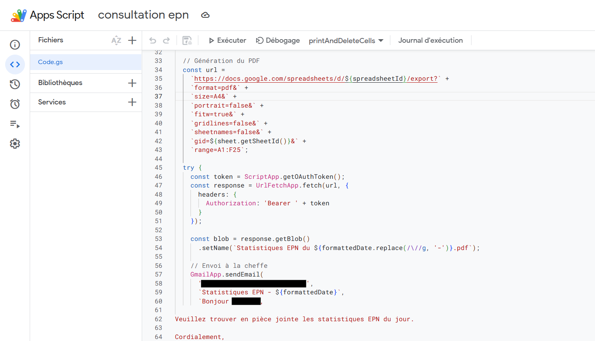

# **google-forms-epn-automation**
## *Automation of EPN attendance statistics using Google Forms, Sheets and Apps Script.*
During the development of the Google Apps Script, AI-based tools were used as a support to explore possible implementations, debug issues, and refine the final solution.

## Context
In my work within a public digital space, attendance statistics were initially collected on paper.  
Visitors were written down manually, then the data had to be re-entered digitally by my superior.

This process caused several concrete issues:
- time-consuming double entry  
- lower reliability in real reception conditions  
- no data collected when I was not present  

The goal of this project was to simplify, secure and automate the entire workflow using existing Google tools, without introducing unnecessary complexity.

## Solution Overview

The solution is intentionally simple and based on standard Google services:
- Google Forms for direct data entry  
- Google Sheets for automatic data centralization  
- Google Apps Script for automation  

On the user side, a Chrome shortcut is configured to open the form instantly, reducing friction, preventing the form from being missed, and making the system accessible even to users with low digital skills.

### Google Sheets – Data centralization

### Google Apps Script – Automation logic

## Features
The automation script provides:
- daily automatic execution via time-based trigger  
- exclusion of weekends and public holidays (handled directly in the script)  
- PDF generation from a specific range of the spreadsheet  
- automatic email sending with the PDF attached  
- confirmation email  
- cleanup of the spreadsheet after sending, without breaking the Google Sheet  

The script is designed to be robust and safe, with no error if the sheet is empty.

## Technical Highlights
- Native Google Sheets PDF export using a limited range (`A1:F25`) to ensure a clean, single-page document.  
- Physical row deletion (`deleteRows`) instead of content clearing to avoid Google Forms indexing issues.  
- Explicit checks for working days and public holidays before execution.  

## Benefits
- removal of paper-based tracking  
- improved data reliability  
- continuous data collection, even in case of absence  
- reduced workload for staff  
- fully automated daily reporting  

## Known Limitations
- Google Forms does not allow automatic redirection after submission (tool limitation); therefore, the user must click on the link to google.com after submitting the form.  

In the future, this system could be replaced by a fully developed web application with its own engine and user authentication.

## Purpose of the Project
This project is shared as:
- a practical automation example  
- a demonstration of problem-solving and workflow optimization  
- a real-world use case of Google Forms, Sheets and Apps Script in a public service context  
